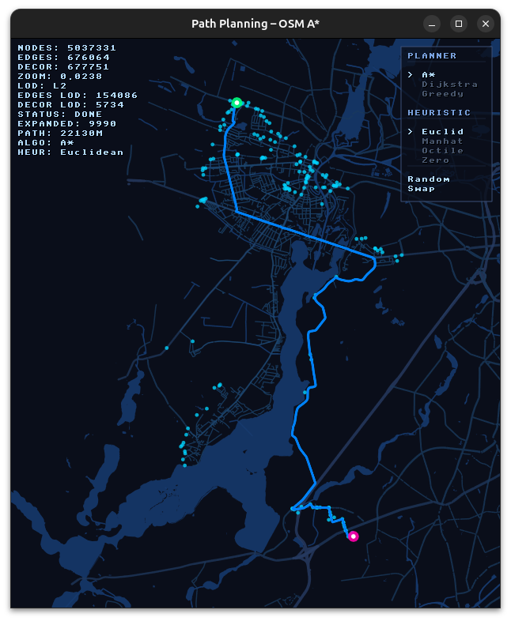
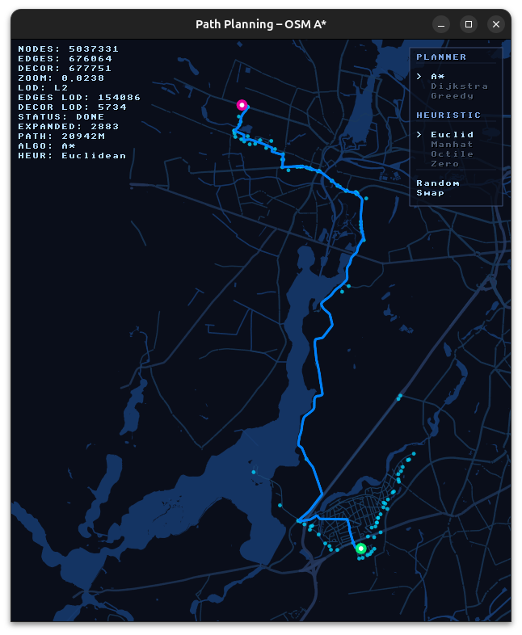
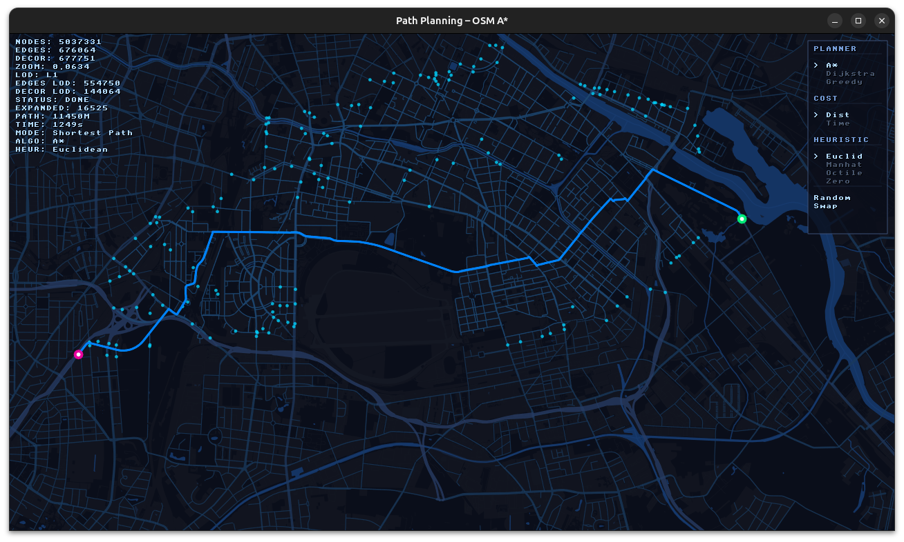
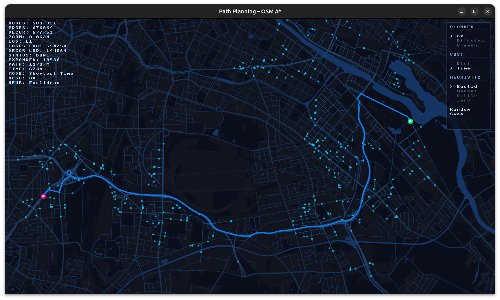

# pathplanning

[](https://github.com/sunsided/pathplanning/actions/workflows/ci.yml)
[](https://www.rust-lang.org/)
[](https://joinup.ec.europa.eu/collection/eupl/eupl-text-eupl-12)
[](https://github.com/linebender/vello)
[](https://github.com/rust-windowing/winit)

Path planning playground on [Berlin OSM (2026-04-25)](https://download.geofabrik.de/europe/germany/berlin.html).


## Directed Graph

Planning is on the directed graph of the Berlin road network.

| A*                                                                                                                               | A* (reverse)                                                                                                                  |
|----------------------------------------------------------------------------------------------------------------------------------|-------------------------------------------------------------------------------------------------------------------------------|
|  |  |

## Usage

### Running

```bash
cargo run --release -- [path/to/map.osm.pbf]
```

Defaults to `maps/berlin.osm.pbf` if no argument is given.

### Mouse Controls

| Action | Control |
|--------|---------|
| Place start marker | Left-click on map |
| Place end marker | Left-click again (second click) |
| Drag start/end marker | Left-click and drag on an existing marker |
| Pan the map | Left-click and drag on empty map area |
| Zoom | Mouse scroll wheel |
| Remove nearest marker | Right-click near a marker |

### Keyboard Controls

| Key | Action |
|-----|--------|
| `R` | Randomize — places start and end markers on two random routable nodes within the current viewport and triggers a search |
| `S` | Swap — swaps the start and end markers |
| `Q` / `Escape` | Clear all markers and reset the planner |
| `A` / `P` | Cycle forward through algorithms (`P` cycles backward) |
| `H` | Cycle forward through heuristics (shift+H for backward) — only active for algorithms that use heuristics |
| `C` | Cycle forward through cost modes (shift+C for backward) |
| `Backspace` | Re-run the search with current markers and configuration |
| `F1` | Toggle the HUD/debug overlay and menu panel |
| `0` | Auto-select LOD tier based on zoom level |
| `1` | Force LOD tier 0 (full detail, use with caution) |
| `2` | Force LOD tier 1 |
| `3` | Force LOD tier 2 (lowest detail) |

### HUD Menu

The top-right HUD panel provides clickable menu items to change planner configuration:

- **PLANNER** section: Select the pathfinding algorithm
- **COST** section: Select the cost function
- **HEURISTIC** section: Select the heuristic (greyed out for Dijkstra et al.)
- **Random**: Places random start/end markers (same as `R` key)
- **Swap**: Swaps start and end markers (same as `S` key)

## Algorithms

Three pathfinding algorithms are available, selectable via the `A`/`P` keys or the HUD menu:

### A*

The default algorithm. Uses `f = g + h` where `g` is the actual cost from start and `h` is the heuristic estimate to goal. A* is optimal (guarantees shortest path) when the heuristic is admissible (never overestimates).

### Dijkstra

Uses `f = g` only — equivalent to A* with a zero heuristic. Explores uniformly outward from the start, guaranteeing optimality but typically expanding significantly more nodes than A*. Useful for comparison and visualization of the search space.

### Greedy Best-First

Uses `f = h` only — ignores actual travel cost and expands toward the goal purely based on the heuristic. Fast but **not optimal**; the resulting path may be longer than necessary. Does not perform relaxation (first visit to a node is final).

## Heuristics

Heuristics estimate the remaining cost from a node to the goal. They are used by A* and Greedy Best-First. All heuristics account for Web Mercator projection distortion by scaling distances with `cos(mean_latitude)` to return ground-true meters.

| Heuristic | Formula | Admissible? | Description |
|-----------|---------|-------------|-------------|
| **Euclidean** | `√(dx² + dy²)` | Yes | Straight-line distance. The most accurate for road networks with free directional movement. Web Mercator coordinates are scaled by `cos(mean_latitude)` to convert back to ground-true meters — without this correction, the heuristic overestimates (especially at Berlin's latitude ~52.5°) and A* returns suboptimal paths. |
| **Manhattan** | `dx + dy` | Yes | Sum of absolute axis differences. Overestimates on diagonal movement, making it inadmissible but sometimes faster. |
| **Octile** | `(dmax - dmin) + dmin × √2` | Yes | Accounts for diagonal movement on grids. Admissible and tighter than Manhattan. |
| **Zero** | `0` | Yes | Reduces A* to Dijkstra. Expands all reachable nodes uniformly. |

Default: **Euclidean**

## Cost Functions

Cost functions determine what the planner optimizes for. Edge costs are derived from OSM road classification data.

### Shortest Path (Distance)



Minimizes total travel distance in meters. Edge cost = `edge.weight_meters`.

Produces the geometrically shortest route regardless of road speed limits or traffic conditions.

### Shortest Time



Minimizes estimated travel time. Edge cost = `edge.travel_time_s + stop_penalty`.

- `travel_time_s` is derived from the road class's maximum speed
- A **stop penalty** is added when traversing edges into nodes with 3+ outgoing connections (intersections), simulating deceleration/waiting time at junctions
- Uses a 90 km/h (25 m/s) ceiling for the heuristic's time estimation

Default: **Shortest Time**

## Cost × Heuristic Interaction

The heuristic's evaluation mode matches the active cost function:

- In **Shortest Path** mode, the heuristic returns distance in meters
- In **Shortest Time** mode, the heuristic returns `distance / MAX_SPEED_MPS` (time estimate)

This ensures the heuristic remains consistent with the cost function, preserving A* optimality guarantees when using admissible heuristics.

## Architecture

| Component | Description |
|-----------|-------------|
| `graph.rs` | Directed road graph with nodes, edges, and road classifications |
| `osm_loader.rs` | OSM PBF file parser and graph construction |
| `planner/` | Pathfinding algorithms (A*, Dijkstra, Greedy) with configurable heuristics and cost modes |
| `spatial_index.rs` | Nearest-node lookup for marker snapping |
| `view_index.rs` | R*-tree spatial index for viewport-based edge queries |
| `lod.rs` | LOD pyramid for multi-scale rendering |
| `camera.rs` | Web Mercator camera with zoom and pan |
| `renderer.rs` | Vello GPU renderer with edge styling, decoration rendering, and HUD |
| `projection.rs` | Web Mercator projection utilities |

## Visualization Layers

The renderer draws in the following order (back to front):

1. **Decorations** — Buildings, landuse, water, pedestrian areas
2. **Road edges** — Styled by road class (motorway, primary, residential, etc.)
3. **Explored edges** — Closed-set edges in dark blue
4. **Frontier nodes** — Open-set nodes as cyan dots
5. **Best path** — Neon cyan (updated during search)
6. **Locked path** — Electric blue (final path when search completes)
7. **Markers** — Green (start) and pink (end)
8. **Debug overlay** — Stats text (top-left)
9. **HUD menu** — Interactive configuration panel (top-right)

## Road Classes

Edges are styled by their OSM road classification:

- Motorway
- Primary
- Secondary
- Tertiary
- Residential
- Service
- Path
- Other

Each class has a distinct stroke width and color, and contributes different speed/stop-penalty values to the time-based cost function.
